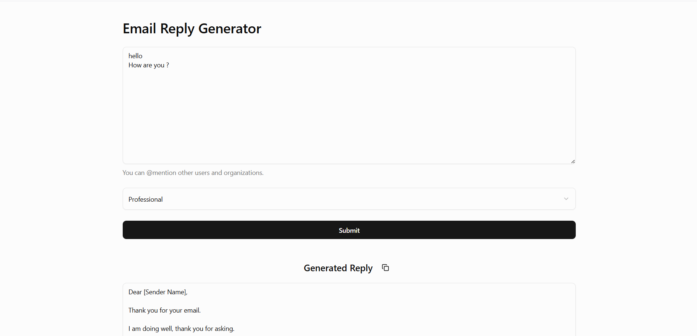
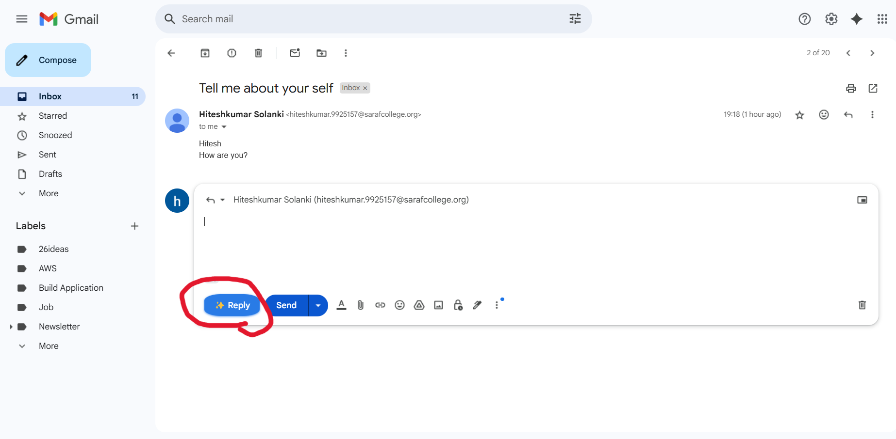

# 📧 Email Reply Generator

The **Email Reply Generator** is an AI-powered tool that helps users craft professional and personalized email replies in seconds. It includes a web interface and extends functionality into a Chrome Extension, enabling real-time reply generation directly within your email inbox.

🔗 **Live Demo Screenshot**

---

**Chrome Extension (Gmail Context)**

/images/video.mp4 to show how it embeds the AI reply button

## 💡 Description

> Writing the perfect email reply can be time-consuming. This tool leverages AI to automatically generate context-aware replies based on the received message. Whether you're aiming for a professional, friendly, or casual tone, the AI crafts an appropriate response instantly.

The project also includes a **Chrome Extension** that injects an "AI Reply" button into your Gmail (or supported email platform) interface, generating responses inline without switching tabs or apps.

---

## 🚀 Features

- 🧠 AI-generated email replies
- ✍️ Multiple tone options (Professional, Friendly, etc.)
- ⚡ Real-time response generation
- 🌐 Simple and clean web interface
- 🧩 Chrome Extension for inline email replies
- 📋 One-click copy to clipboard functionality

---

## 🛠️ Tech Stack

- React.js
- Gemini API (AI model)
- Tailwind CSS (UI Styling)
- Spring Boot
- Java
- Chrome Extension APIs (Manifest v3)

---

## 🧩 Chrome Extension Setup

1. Navigate to `chrome-extension/` directory (if separate).
2. Build or copy `email-writer-ext/` files.
3. Open Chrome → `chrome://extensions/`
4. Enable **Developer Mode**
5. Click **Load Unpacked** → Select the `dist` or `extension` folder
6. Pin the extension and start generating replies in your inbox!

---
